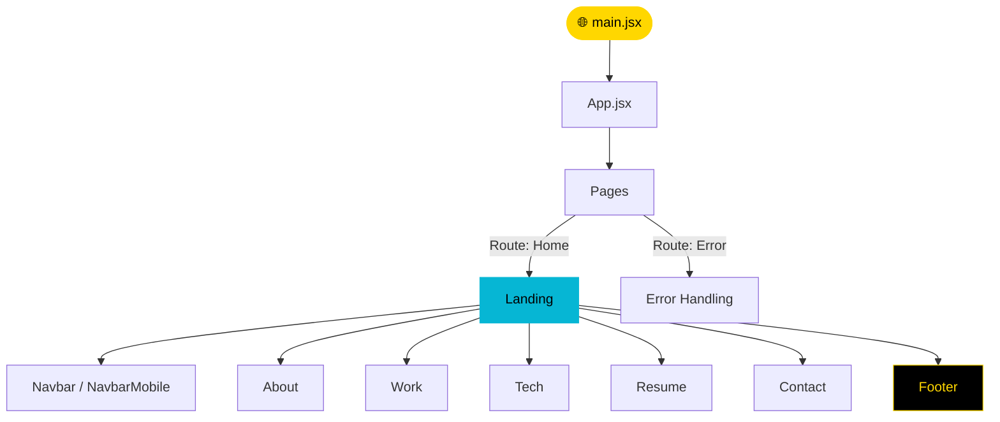

<div align="center">


[](https://git.io/typing-svg)

<br/>

<p align="center">
  <a href="https://github.com/NietoDeveloper">
    
  </a>
  <a href="https://committers.top/colombia#NietoDeveloper">
    
  </a>
  <a href="https://react.dev/">
    
  </a>
  <a href="https://vitejs.dev/">
    
  </a>
  <a href="https://tailwindcss.com/">
    
  </a>
  <a href="https://opensource.org/licenses/MIT">
    
  </a>
</p>

<p align="center">
  <a href="https://github.com/NietoDeveloper/Cannoil-Ejemplo1">
    
  </a>
</p>

</div>

---

## 📋 Overview

**Cannoil E-Commerce** is a specialized online store application designed for health and natural wellness products. Built with a modular React architecture and styled using utility-first CSS frameworks, this project demonstrates clean frontend design, responsive layouts, and organized component structures tailored for modern digital storefronts.

Developed by **Manuel Nieto** (**NietoDeveloper**), ranked **#1 in Colombia** and **#3 in Latin America** on `committers.top`.

---

## 🗂️ Project Structure

```text
Cannoil-Ejemplo1/
├── .vscode/        # Workspace configurations
├── dist/           # Production build output
├── public/         # Static public assets
└── src/
    ├── assets/     # Static images and data sources (e.g., product data)
    ├── Components/ # Modular UI components
    │   ├── About/
    │   ├── Contact/
    │   ├── Footer/
    │   ├── Landing/
    │   ├── Navbar/
    │   ├── NavbarMobile/
    │   ├── Resume/
    │   ├── Tech/
    │   └── Work/
    ├── Pages/      # View controllers (Home, Error handling)
    ├── Utils/      # Helper functions and utilities
    ├── App.jsx     # Root application component
    └── main.jsx    # DOM mounting point
```

---

## 🔄 Component Composition Flow



---

## ✨ Key Features

- **Specialized Health Catalog:** Curated product display showcasing natural wellness goods.
- **Responsive Mobile Navigation:** Dedicated desktop and mobile navigation bars (`Navbar` and `NavbarMobile`) ensuring optimal UX across devices.
- **Modular Component Architecture:** Decoupled sections (`Landing`, `About`, `Work`, `Contact`) for easy maintenance and scalability.
- **Modern Styling:** Fast processing pipeline leveraging PostCSS and Tailwind CSS for a sleek, modern aesthetic.

---

## 🛠️ Technology Stack

<div align="center">

| Category | Technologies |
|:---------|:--------------|
| 🎨 **Frontend Library** | React (JavaScript ES6+) |
| ⚡ **Build Tooling** | Vite |
| 💅 **Styling Framework** | Tailwind CSS, PostCSS |
| 🔧 **Version Control** | Git / GitHub |

</div>

---

## 🚀 Getting Started

### Prerequisites

- Node.js (v18+ recommended)
- npm or yarn

### Installation & Execution

**Step 1 — Clone the repository**

```bash
git clone https://github.com/NietoDeveloper/Cannoil-Ejemplo1.git
```

**Step 2 — Navigate to the project directory**

```bash
cd Cannoil-Ejemplo1
```

**Step 3 — Install dependencies**

```bash
npm install
```

**Step 4 — Run the development server**

```bash
npm run dev
```

**Step 5 — Open your browser** and navigate to `http://localhost:5173` to view the application.

---

## 👨‍💻 Author

**Manuel Nieto (NietoDeveloper)**
Role: Full-Stack Software Engineer & Systems Architect
Location: Bogotá, Colombia
Rankings: #1 in Colombia & #3 in Latin America (committers.top)
Portfolio: [manuelnieto.netlify.app](https://manuelnieto.netlify.app)
GitHub: [@NietoDeveloper](https://github.com/NietoDeveloper)

---

## 📄 License

This project is licensed under the **MIT License**.

<div align="center">

<br/>


</div>
